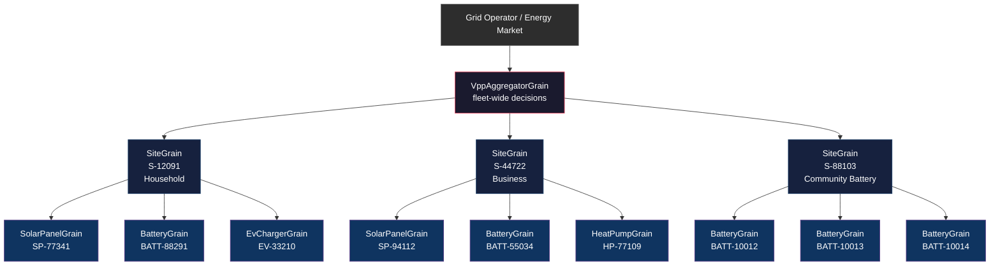
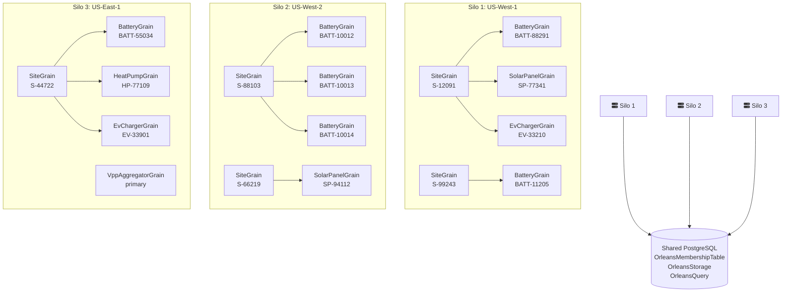

# Building a Virtual Power Plant with Microsoft Orleans — Part 1: Architecture & Data Model

**How the virtual actor model maps perfectly to managing thousands of distributed energy resources**

---

When you plug a Tesla Powerwall into the grid, you're not just storing solar energy — you're joining a network. AGL Energy pays Australian homeowners **$1 per kilowatt-hour** for energy their batteries export during grid events. Tesla coordinates 50,000 homes in South Australia as a 535-megawatt distributed power plant. California tested 100,000 residential batteries dispatching power to neighborhoods during peak demand.

This is a Virtual Power Plant (VPP): thousands of independent, geographically dispersed energy assets — solar panels, batteries, EV chargers, heat pumps — orchestrated through software to behave like a single power plant.

But here's the engineering problem: each asset has its own identity, its own state, its own schedule, and its own hardware communication protocol. Sarah's Tesla Powerwall should never stop charging her EV because Bob's SolarEdge battery in a different suburb received a conflicting dispatch command. The software must manage state for hundreds of thousands of assets, independently, concurrently, and without data loss during failures.

This is the problem Microsoft Orleans was designed to solve. And the mapping between Orleans' virtual actor model and a VPP's asset hierarchy is startlingly natural.

## The hierarchy: Sites, Assets, and Aggregators

A real VPP doesn't just have a flat list of batteries. It has a tree:



Each box above is an independently addressable, stateful **grain** in Orleans.

**Site grains** own the household or business. They know the tariff plan, the baseline consumption profile, and the site-specific energy strategy. When the aggregator issues a fleet-wide command, the site resolves how to execute it locally: "During peak, discharge the battery first, then curtail EV charging if needed."

**Asset grains** own individual hardware. They hold the asset's serial number, its operational schedule, its current state (power output, battery charge percentage, inverter status), and its communication protocol adapter. They don't know or care what other assets are doing.

**The aggregator grain** queries fleet capacity with a single call and dispatches overrides with a broadcast. It doesn't need to know that Sarah's battery is a Tesla and Bob's is an LG — it just calls `IBatteryGrain.GetAvailableCapacity()` on every registered battery.

This is not just an architectural nicety. It means that:

1. **Each grain is single-threaded.** A dispatch command and a telemetry tick can never race inside the same battery grain. No locks. No transactions. No deadlocks.

2. **Each grain is independently persistent.** If the silo hosting Sarah's site grain crashes, it reactivates on another silo, reloads all state from PostgreSQL, and none of Sarah's data is lost. Bob's grains were on a different silo and never noticed.

3. **Each grain is independently addressable.** A technician diagnosing a fault in solar panel `SP-77341` calls `cluster.GetGrain<ISolarPanelGrain>("SP-77341")` directly. They don't need to know which site it belongs to or which silo hosts it.

## The asset grain in code

Here's what a real battery grain looks like. It owns three things:

- **State** (persisted to PostgreSQL): charge percentage, capacity, health metrics, current operating mode
- **Schedule** (per-asset time windows): when to charge, when to discharge, reserve floor percentages
- **A timer** (periodic telemetry): reads the actual hardware status every N seconds

```csharp
public interface IBatteryGrain : IGrainWithStringKey
{
    Task ReportTelemetry(double socPercent, double actualKw);
    Task SetDischargeRate(double kw);
    Task SetSchedule(TimeWindow[] windows);
    Task<double> GetAvailableCapacityKwh();
    Task<BatteryStatus> GetStatus();
}

[Alias("BatteryState")]
public record BatteryState
{
    [Id(0)] public string AssetId { get; set; } = "";
    [Id(1)] public double ChargePercent { get; set; }
    [Id(2)] public double ActualKw { get; set; }
    [Id(3)] public double DesiredDischargeKw { get; set; }
    [Id(4)] public double TotalCapacityKwh { get; set; } = 13.5;
    [Id(5)] public TimeWindow[] Schedule { get; set; } = [];
    [Id(6)] public double ReserveFloorPercent { get; set; } = 20;
    [Id(7)] public DateTimeOffset LastTelemetry { get; set; }
}
```

```csharp
public class BatteryGrain : Grain, IBatteryGrain
{
    private readonly IPersistentState<BatteryState> _state;
    private readonly IProtocolAdapter _protocol;
    private IGrainTimer? _telemetryTimer;

    public BatteryGrain(
        [PersistentState("battery", "AdoNet")] IPersistentState<BatteryState> state,
        IProtocolAdapter protocol)
    {
        _state = state;
        _protocol = protocol;
    }

    public override Task OnActivateAsync(CancellationToken ct)
    {
        _telemetryTimer = this.RegisterGrainTimer(
            static (grain, ct) => ((BatteryGrain)grain).ReadHardware(ct),
            this,
            new GrainTimerCreationOptions
            {
                DueTime = TimeSpan.FromSeconds(5),
                Period = TimeSpan.FromSeconds(15),   // BMS polling interval
                KeepAlive = true
            });
        return Task.CompletedTask;
    }

    public async Task SetDischargeRate(double kw)
    {
        _state.DesiredDischargeKw = kw;
        await _state.WriteStateAsync();           // Persist intent immediately
        await _protocol.SendCommand(              // Tell the physical hardware
            _state.AssetId, "set_discharge", new { power_kw = kw });
    }

    public Task<double> GetAvailableCapacityKwh()
    {
        var available = Math.Max(0,
            _state.ChargePercent - _state.ReserveFloorPercent);
        return Task.FromResult(_state.TotalCapacityKwh * available / 100.0);
    }

    public Task<BatteryStatus> GetStatus() => Task.FromResult(new BatteryStatus
    {
        AssetId = _state.AssetId,
        ChargePercent = _state.ChargePercent,
        ActualKw = _state.ActualKw,
        Mode = _state.DesiredDischargeKw > 0 ? "discharging" : "idle",
        LastTelemetry = _state.LastTelemetry
    });

    private async Task ReadHardware(CancellationToken ct)
    {
        var status = await _protocol.ReadStatus(_state.AssetId);
        if (status is null) return;
        _state.ChargePercent = status.SocPercent;
        _state.ActualKw = status.ActualPowerKw;
        _state.LastTelemetry = DateTimeOffset.UtcNow;
        await _state.WriteStateAsync();

        // If in override mode, re-send command to ensure hardware is honoring it
        if (_state.DesiredDischargeKw > 0
            && Math.Abs(_state.ActualKw - _state.DesiredDischargeKw) > 0.5)
        {
            await _protocol.SendCommand(
                _state.AssetId, "set_discharge",
                new { power_kw = _state.DesiredDischargeKw });
        }
    }
}
```

Notice the separation: `_state` holds the grain's truth (what the battery **should** be doing). `_protocol` communicates with the physical hardware (what the battery **is actually** doing). The timer reconciles them every 15 seconds. If there's a discrepancy — the desired discharge is 2kW but the hardware reports 1.2kW — the timer re-sends the command.

## The site grain: coordinating within a household

A site with solar, a battery, and an EV charger has competing priorities. The battery should charge during off-peak, but if the EV is plugged in and the driver leaves at 7am, the EV gets priority. The site grain resolves this:

```csharp
public class SiteGrain : Grain, ISiteGrain
{
    private readonly IPersistentState<SiteState> _state;

    public SiteGrain(
        [PersistentState("site", "AdoNet")] IPersistentState<SiteState> state)
    {
        _state = state;
    }

    public async Task OnFleetDischargeCommand(double kwPerSite)
    {
        // 1. Check if battery can fulfill the request
        var battery = GrainFactory.GetGrain<IBatteryGrain>(_state.BatteryId);
        var available = await battery.GetAvailableCapacityKwh();

        if (available * 1000 >= kwPerSite)
        {
            await battery.SetDischargeRate(kwPerSite);
            return;
        }

        // 2. If battery is insufficient, curtail EV charging
        var ev = GrainFactory.GetGrain<IEvChargerGrain>(_state.EvChargerId);
        var evStatus = await ev.GetStatus();
        if (evStatus.IsCharging)
        {
            await ev.PauseCharging();
            await battery.SetDischargeRate(kwPerSite);
        }
    }

    public async Task<double> GetFleetCapacityKwh()
    {
        var battery = GrainFactory.GetGrain<IBatteryGrain>(_state.BatteryId);
        return await battery.GetAvailableCapacityKwh();
    }

    public async Task RegisterAsset(string assetType, string assetId)
    {
        switch (assetType)
        {
            case "battery": _state.BatteryId = assetId; break;
            case "solar": _state.SolarPanelId = assetId; break;
            case "ev": _state.EvChargerId = assetId; break;
        }
        await _state.WriteStateAsync();
    }
}
```

The site grain orchestrates locally. The aggregator grain orchestrates globally:

```csharp
public async Task DispatchFleetDischarge(double targetMw)
{
    double totalCapacity = 0;
    foreach (var siteId in _state.RegisteredSites)
    {
        var site = GrainFactory.GetGrain<ISiteGrain>(siteId);
        totalCapacity += await site.GetFleetCapacityKwh();
    }

    if (totalCapacity * 1000 < targetMw)
    {
        // Not enough capacity — partial dispatch or alert grid operator
        targetMw = totalCapacity * 1000;
    }

    var kwPerSite = targetMw * 1000 / _state.RegisteredSites.Count;
    var tasks = _state.RegisteredSites.Select(id =>
        GrainFactory.GetGrain<ISiteGrain>(id).OnFleetDischargeCommand(kwPerSite));

    await Task.WhenAll(tasks); // Parallel — thousands of sites concurrently
}
```

## How Orleans hosts it all: the silo architecture

An Orleans **silo** is the process that hosts grain activations. In production, you run multiple silos, and Orleans distributes grains across them automatically:



Key design decisions:

**1. Clustering via PostgreSQL (not localhost).** Silos discover each other by reading the `OrleansMembershipTable` in PostgreSQL. When a new silo starts, it registers itself. When one fails, the others detect it within seconds. This is why we use `UseAdoNetClustering()` instead of `UseLocalhostClustering()`.

**2. Grain state lives in PostgreSQL, not silo memory.** When a grain calls `await _state.WriteStateAsync()`, its state is serialized as binary and persisted. If the silo crashes, the grain reactivates on another silo, reads its state from PostgreSQL, and continues. No data loss.

**3. Database auto-provisioning.** The silo's startup code checks if the required tables exist. If not, it creates them — clustering tables, storage tables, all the stored procedures — fully automated. No DBA needed.

**4. Persistent data volumes.** `WithDataVolume()` ensures the PostgreSQL container's data survives restarts. Kill the entire stack, restart it, and every battery's last reported state is still there.

**5. The API gateway connects as a client, not a silo.** The `ApiService` project uses `UseOrleansClient()` with ADO.NET clustering — it can discover silos and invoke grains but doesn't host grains itself. Multiple API instances can run behind a load balancer.

## The complete project structure

```
VPP-ORLEANS/
├── VPP-ORLEANS.AppHost/              Aspire orchestration
│   └── AppHost.cs                    PostgreSQL + service startup ordering
├── VPP-ORLEANS.GrainInterfaces/      Shared contracts (NuGet package candidate)
│   ├── ISiteGrain.cs
│   ├── IBatteryGrain.cs
│   ├── ISolarPanelGrain.cs
│   ├── IEvChargerGrain.cs
│   └── IVppAggregatorGrain.cs
├── VPP-ORLEANS.Grains/               Grain implementations
│   ├── SiteGrain.cs                  Coordinates household assets
│   ├── BatteryGrain.cs               Battery digital twin + protocol adapter
│   ├── SolarPanelGrain.cs            Solar inverter digital twin
│   ├── EvChargerGrain.cs             EV charger digital twin
│   └── VppAggregatorGrain.cs         Fleet-wide orchestration
├── Silo/                             Orleans server host
│   └── Program.cs                    ADO.NET clustering + DB auto-provisioning
├── VPP-ORLEANS.ApiService/           REST API gateway
│   └── Program.cs                    /sites, /batteries, /fleet endpoints
├── VPP-ORLEANS.Web/                  Blazor dashboard
│   ├── ScheduleApiClient.cs          Typed HTTP clients
│   └── Components/Pages/             Real-time monitoring UI
├── VPP-ORLEANS.ServiceDefaults/      OpenTelemetry + health checks
│   └── Extensions.cs
└── VPP-ORLEANS.ProtocolAdapters/     Hardware communication layer
    ├── IProtocolAdapter.cs
    ├── Ieee2030Adapter.cs            California Rule 21
    ├── OpenAdrAdapter.cs             Demand response standard
    └── TeslaApiAdapter.cs            Proprietary vendor API
```

The `GrainInterfaces` project contains only interface contracts and serializable state records — it's the API surface between layers. The `Grains` project implements them. The `ApiService` references only `GrainInterfaces`, never `Grains` — clean separation. Both can be packed as NuGet packages for team boundaries.

## Why this beats microservices

For a VPP, each DER is a stateful entity that must be managed independently. With microservices, you'd need:

- A database per service (or careful partitioning across Postgres tables)
- A service mesh for routing requests to the right instance
- Manual retry logic with exponential backoff
- An external scheduler for periodic telemetry collection
- A distributed lock or transaction manager to prevent conflicting commands

With Orleans, you get all of this for free:

| Concern | Microservices | Orleans |
|---|---|---|
| Stateful entities | Stateless + external DB per call | Grain holds state in memory, syncs to DB on write |
| Concurrency | Distributed locks, sagas | Single-threaded grain — no locks needed |
| Failover | Manual health checks, DNS re-routing | Automatic activation on healthy silo |
| Telemetry polling | External cron/job scheduler | Built-in `RegisterGrainTimer` |
| Scheduled operations | External scheduler + database | Built-in persistent `IRemindable` |
| Request routing | Service mesh, circuit breakers | Orleans runtime routes transparently |

The key insight: **grains aren't just a different way to organize code — they're a fundamentally different execution model.** Each grain is single-threaded, persistent, and independently lifecycle-managed. This maps perfectly to a physical DER that is single-threaded (one set of hardware at a time), persistent (has a known serial number and configuration), and independently lifecycle-managed (connects and disconnects from the grid on its own terms).

## Get started

```bash
git clone https://github.com/your-org/vpp-orleans
cd vpp-orleans
dotnet run --project VPP-ORLEANS.AppHost
```

Docker must be running. The Aspire dashboard opens at `https://localhost:17004`. The silo auto-creates all PostgreSQL tables. Navigate to `/schedule` for the real-time demo page.

---

**Next: Part 2 — Grain Persistence: State That Survives Anything**

How `IPersistentState<T>` works under the hood, the PostgreSQL schema for grain storage, optimistic concurrency patterns, multi-grain state coordination, and a step-by-step walkthrough of what happens when a silo crashes.

---

*Orleans 10.2.2 | .NET 10.0 | Aspire 13.4.6 | Npgsql 10.0.3*

*References: Tesla South Australia VPP (50,000 homes), AGL VPP program ($1/kWh credits), California VPP pilot (100,000 batteries, 535 MW), Wood Mackenzie 2025 VPP capacity report*